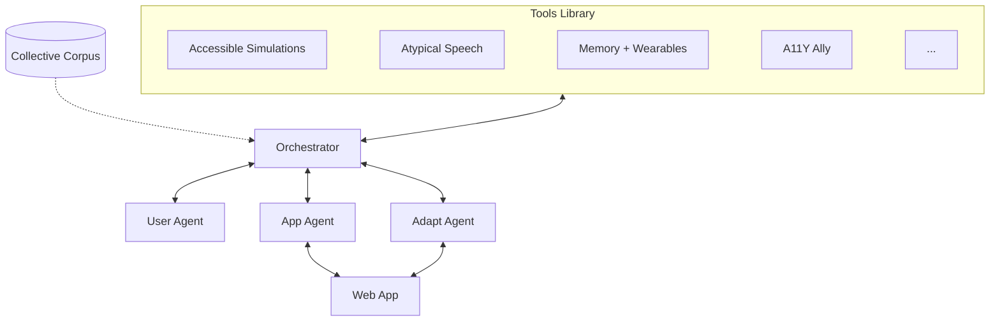

<div align="center">

# AI for Accessibility Toolkit

**AI agents that adapt the web to each user's abilities.**

[](CONTRIBUTING.md)
[](https://github.com/chuanenlin/AI-for-Accessibility-Toolkit-Draft/graphs/contributors)
[](LICENSE)

[Architecture](docs/architecture.md) · [Contributing](CONTRIBUTING.md) · [Projects](projects/) · [Code of Conduct](CODE_OF_CONDUCT.md)

</div>

---

We are a collective of 8 research institutions building AI tools that adapt the web to user's abilities. Each team contributes a project — the toolkit gives them shared infrastructure.

## Why This Toolkit

Existing tools like [axe-core](https://github.com/dequelabs/axe-core) and [Pa11y](https://github.com/pa11y/pa11y) give you a list of violations. This toolkit *adapts* the page — AI agents analyze what the page is, understand what the user needs, and compose the right tools to make it work for them. Not a report. A working page.

## Getting Started

**Install**

```bash
pip install ai4a11y && playwright install chromium
```

Set your API key (Google Gemini by default):

```bash
cp .env.example .env
# add your GOOGLE_API_KEY to .env
```

**CLI**

```bash
# check a page for accessibility issues
a11y check https://example.com
a11y check https://example.com --profile blv    # check for a specific ability profile

# adapt a page for a specific ability profile
a11y adapt https://example.com --profile blv
a11y adapt https://example.com --profile blv,motor  # combine profiles

# explore what's available
a11y tools                                      # show installed tools and transforms
a11y profiles                                   # show all 18 ability profiles
```

**Python**

```python
from ai4a11y import check, adapt

# check — AI analyzes the page and selects the right tools
result = check("https://example.com")
result = check("https://example.com", profile="blv")    # filter by ability profile

result.plan           # the orchestrator's reasoning
result.tools_run      # which tools the AI chose to run
result.issues         # all issues found
result.critical       # filter by severity

# adapt — AI plans adaptations and prioritizes by impact
result = adapt("https://example.com", profile="blv")
result = adapt("https://example.com", profile=["blv", "motor"])  # combine profiles

result.plan           # why these adaptations were chosen
result.adaptations    # prioritized adaptations
```

## Contributing

```bash
a11y create my-tool
```

```
my-tool/
├── my_tool/
│   ├── __init__.py
│   └── tool.py          # implement your tool here
├── tests/
│   └── test_my_tool.py
├── pyproject.toml
└── README.md
```

Implement your tool in `tool.py`, then `pip install -e .` to register it. The toolkit [discovers installed tools automatically](docs/architecture.md#auto-discovery).

See [CONTRIBUTING.md](CONTRIBUTING.md) for full guidelines and [docs/architecture.md](docs/architecture.md) for the plugin interface.

## Ability Profiles

| Profile | Sub-profiles | Needs |
|---------|-------------|-------|
| `blv` | `blind`, `low_vision`, `color_blind` | Screen reader, audio-first, high contrast, magnification |
| `dhh` | `deaf`, `hard_of_hearing` | Captions, visual emphasis, sign language |
| `motor` | `limited_mobility`, `tremor` | Keyboard-only, switch access, voice control |
| `cognitive` | `dyslexia`, `idd`, `autism` | Plain language, simplified UI, predictable navigation |
| `speech` | `nonverbal`, `atypical_speech` | Alternative input, tuned speech recognition |
| `aging` | | Large text, high contrast, captions, simplified UI, memory aids |

## How It Works

1. **Understand** — App Agent parses the page; User Agent represents the user's abilities and needs
2. **Plan** — Orchestrator matches the page content against the user's profile to decide which tools to run
3. **Analyze** — tools scan for accessibility issues
4. **Adapt** — Adapt Agent prioritizes fixes by impact and transforms content across modalities (image → alt text, chart → sonification, text → plain language)

## Architecture

Each agent reasons about its decisions — the orchestrator plans which tools to run, the app agent understands page semantics, and the adapt agent prioritizes adaptations by impact. See [docs/architecture.md](docs/architecture.md) for full details.



| Service | Role | Example |
|---------|------|---------|
| **Orchestrator** | *Plans* — analyzes the page + user, decides which tools to activate | "This data page + BLV user → run sonification + alt-text tools" |
| **User Agent** | Knows *who* the user is — ability profile, preferences, interaction history | "This user is BLV and needs audio-first output" |
| **App Agent** | Understands *what the page is* — parses DOM + AI semantic analysis | "This page has charts, missing alt text, and low-contrast text" |
| **Adapt Agent** | *Adapts* — prioritizes fixes, resolves conflicts, transforms content | Image → alt text, chart → sonification, text → plain language |

The **Collective Corpus** — accessibility guidelines, best practices, personas, benchmarks — is curated by the Data working group.

## What We're Building

> Teams, please feel free to update your project info directly.

| Project | Team | What it does |
|---------|------|-------------|
| Accessible simulations | Stanford | Crossmodal explorable simulations for STEM learning (visual → audio/haptic) |
| AiSee / SeEar | MIT Media Lab | AI headphones for BLV users, AR captioning for DHH students |
| Memoro / MemPal | MIT Media Lab | Wearable memory assistant and object retrieval for older adults |
| A11Y Ally | RIT / NTID | Conversational AI wizard for accessibility design recommendations |
| Atypical speech | RNID | Speech recognition for non-standard speech (builds on Project Euphonia) |
| ArtInsight | UW | AI-powered art descriptions and spatial browsing for BLV users |
| PWD reviewer network | The Arc | Compensated human reviewers with disabilities for validation |
| Global evaluation | UCL GDI Hub | Evaluation frameworks for low-resource and global contexts |
| NAI + infrastructure, [https://github.com/paradigms-of-intelligence/ai-for-accessibility](demo app) | Google | Orchestrator framework, Euphonia ASR, A2UI protocol, compute |

See [projects/](projects/) for contributed code.

## Roadmap

### Month 1 — Collect
- [x] Repo + architecture proposal
- [ ] Teams contribute existing projects
- [ ] V1 architecture spec

### Month 3 — Build
- [ ] V1 implementation
- [ ] All teams' projects integrated
- [ ] Agent↔corpus connections
- [ ] Co-design sessions with people with disabilities

### Month 6 — Ship
- [ ] Documentation
- [ ] Example applications
- [ ] Interactive playground
- [ ] Public release

---

<div align="center">

[Stanford University](https://www.stanford.edu/) · [Google](https://www.google.org/) · [University of Washington](https://www.washington.edu/) · [MIT Media Lab](https://www.media.mit.edu/) · [UCL GDI Hub](https://www.disabilityinnovation.com/) · [RIT/NTID](https://www.rit.edu/ntid/) · [The Arc](https://thearc.org/) · [RNID](https://rnid.org.uk/)

</div>
