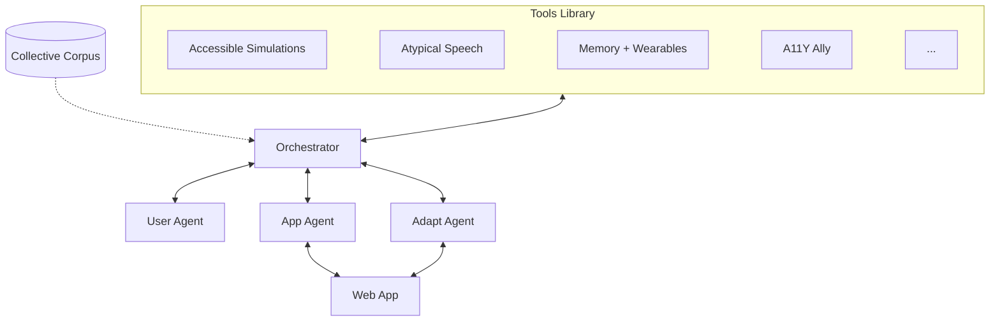

# Architecture

> Working proposal from the March 2026 design sprint. Evolves as teams contribute.

## Core Idea

Each team across the collective is building something concrete — accessible simulations, atypical speech tools, memory aids, design assistants. The toolkit gives these projects shared infrastructure and a way to compose with each other.

"Agents all the way down" means each shared service is an agent that can be used on its own or wired together with others. But the agents aren't the product — the contributed projects are.

## Principles

- **Projects are the toolkit** — each team contributes tools that handle real accessibility needs
- **Shared infrastructure, not monoliths** — agents are services that projects plug into
- **Ability-based design** — adapt to what users can do, not what they can't
- **Human in the loop** — people with disabilities involved in validation, not just as end users
- **Web-first** — start with web apps, expand later (MIT Media Lab exploring wearables)
- **Build on existing tools** — axe-core, W3C AT Driver, etc. instead of rebuilding

## How Projects Map In

Each team contributes a project. Projects provide capabilities in one or more areas:

| Project | Team | What it provides |
|---------|------|-----------------|
| Accessible simulations | Stanford | Crossmodal transforms for STEM content (visual → audio, haptic) |
| AiSee / SeEar | MIT Media Lab | Wearable access interfaces (AI headphones for BLV, AR captioning for DHH) |
| Memoro / MemPal | MIT Media Lab | Interaction memory, wearable object retrieval for older adults |
| A11Y Ally | RIT / NTID | Design artifact analysis, accessibility recommendations via conversational AI |
| Atypical speech | RNID | Speech recognition for non-standard speech (builds on Project Euphonia) |
| ArtInsight | UW | AI-powered art descriptions and spatial browsing for BLV users |
| PWD reviewer network | The Arc | Compensated human reviewers with disabilities for validation |
| Global evaluation | UCL GDI Hub | Evaluation frameworks for low-resource and global contexts |
| NAI + infrastructure | Google | Orchestrator framework, Euphonia ASR, A2UI protocol, compute |
| *Your project* | *Your team* | [Add yours](../CONTRIBUTING.md) |

Not every project maps neatly to one agent — that's fine. This table grows as teams contribute.

## Shared Agent Services

Infrastructure that projects can use. Each is an agent that works standalone or composed.



### Orchestrator

Analyzes the page and plans which tools to run for each user.

- AI plans which tools to activate based on page content + user profile
- Falls back to rule-based profile filtering if the AI call fails
- Manages a shared browser session — one Playwright instance per audit, reused by AppAgent and all tools
- Auto-discovers installed tools via Python entry points
- Similar to [Google NAI](https://developers.google.com/natively-adaptive-interfaces) which reconfigures UIs in real-time

### User Agent

- User preferences (contrast, font size, input method, modality)
- Ability profiles (with consent)
- Interaction history (learns from past sessions)
- Preference portability across apps

**Ability profiles** — combinable (e.g., `["blv", "motor"]` for a blind user with limited mobility):

| Profile | Sub-profiles | Primary needs |
|---------|-------------|--------------|
| `blv` | `blind`, `low_vision` | Screen reader, audio-first, high contrast, magnification |
| `color_blind` | | Color-safe design: no color-only info, patterns, labels |
| `dhh` | `deaf`, `hard_of_hearing` | Captions, visual emphasis, sign language |
| `motor` | `limited_mobility`, `tremor` | Keyboard-only, switch access, voice control |
| `cognitive` | `dyslexia`, `idd`, `autism` | Plain language, simplified UI, predictable navigation |
| `speech` | `nonverbal`, `atypical_speech` | Alternative input, tuned speech recognition |
| `aging` | | Combined vision + hearing + motor + memory decline |

### App Agent

- Parses web app UI elements and capabilities via Playwright
- AI semantic analysis — understands page purpose, content types, and accessibility challenges beyond raw DOM
- Interfaces with accessibility APIs (ARIA roles, etc.)
- Can use [W3C AT Driver](https://github.com/w3c/at-driver) for programmatic screen reader control

### Adapt Agent

- Generates adaptations based on the user's ability profile
- AI prioritizes adaptations by impact and resolves conflicts between tools targeting the same element
- Runs `BaseTool.adapt()` on each tool to collect suggested fixes
- Runs modality transforms: visual → audio, text → simplified text, data → accessible representations
- Pluggable — projects add new transforms as `BaseTransform` tools
- Transforms return `TransformResult` with content, MIME type, and metadata (supports text, audio bytes, structured data)

## Collective Corpus

WG #2 (Data) curates the content. We define how agents access it.

- Accessibility guidelines (WCAG, ARIA, platform-specific)
- Best practices and design patterns
- User personas and scenarios
- Evaluation benchmarks

## Build On, Don't Rebuild

| Need | Use | Don't build |
|------|-----|-------------|
| WCAG rule checking | [axe-core](https://github.com/dequelabs/axe-core) | Custom rule engine |
| Screen reader automation | [W3C AT Driver](https://github.com/w3c/at-driver), [Guidepup](https://github.com/guidepup/guidepup) | Custom SR protocol |
| Agent output format | [A2UI](https://github.com/google/A2UI) (declarative JSON for accessible UIs) | Custom UI spec |
| CI accessibility checks | [axe-core GitHub Actions](https://github.com/dequelabs/axe-core), [Pa11y CI](https://github.com/pa11y/pa11y-ci) | Custom CI tooling |
| UI reconfiguration | [Google NAI](https://blog.google/company-news/outreach-and-initiatives/accessibility/natively-adaptive-interfaces-ai-accessibility/) (orchestrator + sub-agents) | Custom orchestration from scratch |

## Plugin Interface

Teams add new capabilities by implementing `BaseTool` or `BaseTransform`.

### BaseTool — detect issues and suggest fixes

```python
from ai4a11y.tools.base import BaseTool
from ai4a11y.models import Adaptation, Issue, PageContext

class MyTool(BaseTool):
    name = "my-tool"
    description = "What this tool does"
    ability_profiles = ["blv"]       # who it helps
    wcag_criteria = ["1.1.1"]        # which standards it addresses

    def analyze(self, page: PageContext) -> list[Issue]:
        # Detect issues
        ...

    def adapt(self, page, profile) -> list[Adaptation]:
        # Suggest or apply fixes (optional)
        ...
```

### BaseTransform — convert content across modalities

```python
from ai4a11y.tools.base import BaseTransform
from ai4a11y.models import Element, TransformResult

class ChartToAudio(BaseTransform):
    name = "chart-to-audio"
    source_modality = "visual"
    target_modality = "audio"

    def can_transform(self, element: Element) -> bool:
        return element.tag in ("canvas", "svg")

    def transform(self, element, profile) -> TransformResult:
        audio_bytes = sonify(element)  # your logic here
        return TransformResult(
            content=audio_bytes,
            content_type="audio/wav",
            metadata={"duration_ms": 2000},
        )
```

`TransformResult` wraps content with its MIME type and metadata — supports text (`text/plain`), audio (`audio/wav`), structured data (`application/json`), or anything else.

### Scaffolding and testing

Create a new tool project: `a11y create my-tool`

Every tool must pass `StandardToolTests` — see `ai4a11y/testing/standard.py`.

### Auto-Discovery

Installed tools are discovered automatically via Python entry points. When you create a project, the generated `pyproject.toml` already declares the entry point:

```toml
[project.entry-points."ai4a11y.tools"]
my-tool = "my_tool.tool:MyTool"
```

`pip install` your tool, and the Orchestrator picks it up — no manual registration needed.

## Repo Structure

```
ai4a11y/                 # Python package (pip install ai4a11y)
  agents/                #   UserAgent, AppAgent, AdaptAgent
  tools/                 #   BaseTool, BaseTransform, registry
    builtin/             #   Built-in tools (WCAG check via axe-core)
  scaffold/              #   Project template generator
  testing/               #   StandardToolTests, StandardTransformTests
  cli.py                 #   CLI entry point (a11y check, adapt, tools, create)
  orchestrator.py        #   Coordinates agents and tools
  llm.py                 #   Multi-provider LLM client (Google, Anthropic, OpenAI)
  profiles.py            #   Ability profiles (blv, dhh, motor, etc.)
  models.py              #   Issue, Adaptation, PageContext, AuditResult, TransformResult
.env.example             # API key template
projects/                # Contributed projects from each team
corpus/                  # Shared knowledge base (with Data working group)
  guidelines/
  best-practices/
  personas/
  benchmarks/
docs/
  architecture.md
tests/                   # Test suite
```

## Open Questions

- **Corpus format** — structured DB, flat files, vector store?
- **How agents interact with web apps** — browser extension, proxy, API?
- **User profile storage and privacy**
